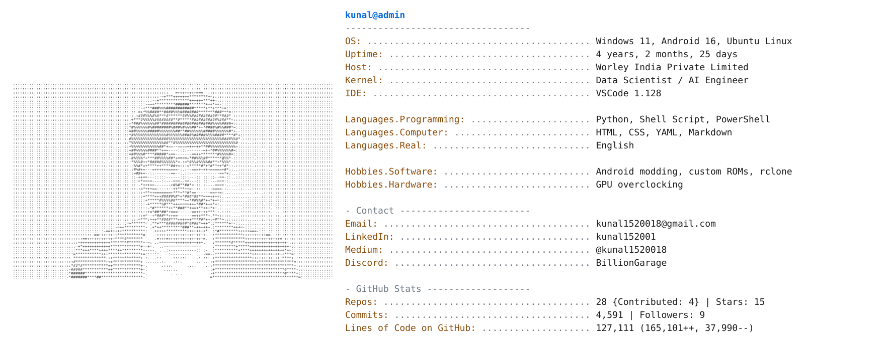
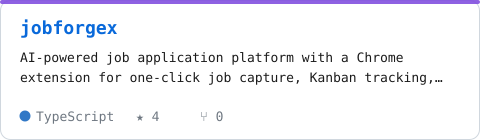
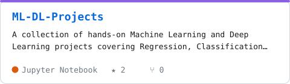
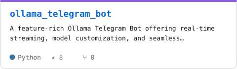
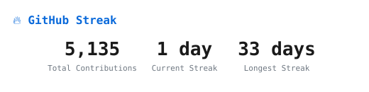
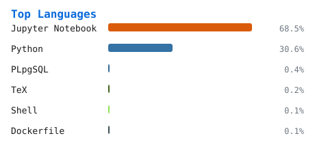
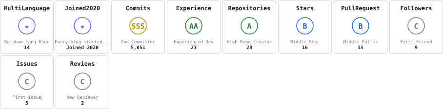

<picture><source media="(prefers-color-scheme: dark)" srcset="header-dark.svg"></picture>

## 👨‍💻 About Me

- 🔭 Data Scientist / AI Engineer at **Worley India**, building intelligent systems and AI pipelines
- 🤖 Focused on **Gen AI**, automation and clean, maintainable code
- 🛠️ Off the clock: Android modding, custom ROMs and GPU overclocking
- 📫 Reach me at [kunal1520018@gmail.com](mailto:kunal1520018@gmail.com) or on [LinkedIn](https://linkedin.com/in/kunal152001)

## 💻 Tech Stack

          

<b>See the full toolbox</b>

 
<table>
<tr><td><b>🧠 AI / ML & Data</b></td><td>

       

</td></tr>
<tr><td><b>☁️ Cloud & Hosting</b></td><td>

      

</td></tr>
<tr><td><b>🗄️ Databases</b></td><td>

     

</td></tr>
<tr><td><b>💻 Languages & Markup</b></td><td>

      

</td></tr>
<tr><td><b>🛠️ DevOps & Tools</b></td><td>

          

</td></tr>
<tr><td><b>🎨 Design & Media</b></td><td>

    

</td></tr>
</table>

## 🚀 Featured Projects

<!-- PROJECTS:START -->
<a href="https://github.com/KunalScriptz/ollama_telegram_bot"><picture><source media="(prefers-color-scheme: dark)" srcset="projects/project-1-dark.svg"></picture></a> <a href="https://github.com/KunalScriptz/jobforgex"><picture><source media="(prefers-color-scheme: dark)" srcset="projects/project-2-dark.svg"></picture></a> <a href="https://github.com/KunalScriptz/ML-DL-Projects"><picture><source media="(prefers-color-scheme: dark)" srcset="projects/project-3-dark.svg"></picture></a> <a href="https://github.com/KunalScriptz/atlas-ai"><picture><source media="(prefers-color-scheme: dark)" srcset="projects/project-4-dark.svg"></picture></a>
<!-- PROJECTS:END -->

## 📊 GitHub Stats

<picture><source media="(prefers-color-scheme: dark)" srcset="streak-dark.svg"></picture>
<picture><source media="(prefers-color-scheme: dark)" srcset="top-langs-dark.svg"></picture>

<picture><source media="(prefers-color-scheme: dark)" srcset="contrib-dark.svg"></picture>

### 🏆 Trophies

<picture><source media="(prefers-color-scheme: dark)" srcset="trophies-dark.svg"></picture>

## 📡 Latest Activity

<!-- ACTIVITY:START -->
<!-- ACTIVITY:END -->

### ✍️ From the Blog

<!-- BLOG:START -->
- 📝 [I Automated My Job Search With This Open-Source AI Pipeline — Here’s What Happened](https://medium.com/@kunal1520018/i-automated-my-job-search-with-this-open-source-ai-pipeline-heres-what-happened-bbaf61d79000) — 27 Jun 2026
- 📝 [whichllm: The Smart Way to Find the Right Local LLM for Your Hardware](https://medium.com/@kunal1520018/whichllm-the-smart-way-to-find-the-right-local-llm-for-your-hardware-a6bbb424b049) — 26 May 2026
- 📝 [How to Deploy Docker Apps Automatically with a Self Hosted GitHub Actions Runner](https://medium.com/@kunal1520018/how-to-deploy-docker-apps-automatically-with-a-self-hosted-github-actions-runner-bcafdea1f164) — 25 May 2026
<!-- BLOG:END -->

## 🐍 Contribution Snake

<picture><source media="(prefers-color-scheme: dark)" srcset="https://raw.githubusercontent.com/KunalScriptz/KunalScriptz/output/github-snake-dark.svg"></picture>

<picture><source media="(prefers-color-scheme: dark)" srcset="quote-dark.svg"></picture>

---

<b>💰 Enjoy my work? You can support it</b>  

